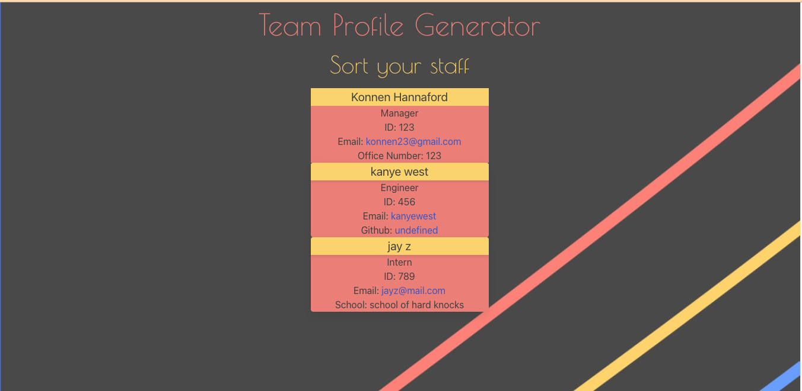

konnenhannaford/Team-Profiles-Generator
# Team Profile Generator

Github Repo
https://github.com/konnenhannaford/Team-Profiles-Generator

Demo Link
https://drive.google.com/file/d/1mKT_-wx86Zm7M0GsVZOyZ3ZKE0T1FmCU/view

### Table of Contents  
  
   1. [Project Description](#1-description)
   2. [Technology Used](#2-technology)
   3. [Installation](#3-installation)
   4. [Usage](#4-usage)
   5. [License](#5-license)
   6. [Contribute](#6-how-to-contribute)
   7. [Tests](#7-tests)

---
### 1. Description  

**What is this project?**  
* 
The Team Profile Generator is an app to generate a HTML webpage using the command line. Once information is entered using inquirer, a page is created with the entered  team member's details .  Along with this, tests have been icnorporated to test for proper functioning

**Why this project?**  
* This allows the learning of inquirer as well as using jest in roder to test for functioning code

#### Screengrab

 

**What problem does this project solve?**  
* This gives the user an ability to generate a team profile which can be dynamically updated.  This could be further expanded to make it a work roster or include other updateable features

**Lessons learnt?**  
* Using Inquirer to create a html document
* Using Testing to test for functional code

---
### 2. Technology

- Javascript
- HTML
- CSS
- Inquirer
- Jest
- Bulma
  
---
### 3. Installation 
You can download the source code from [my Github repository](https://github.com/konnenhannaford/Team-Profiles-Generator) and unzip the files to a location on your computer. 

---

### 4. Usage  
- Running npm i after downloading will bring in any required dpendencies
- Npm start will start the app and bring up prompts for input 
- Users can enter information for managers, engineers and interns 
- Once satisfied, the user can exit upon which a html page is generated in the dist folder.  
- This can be opened to the browser to view the updated information just entered

---
### 5. License  
 The works in this repository are subject to:  

---
### 6. Contributers  
[Konnen Hannaford](https://github.com/konnenhannaford)

You can contribute by opening a pull request or submitting an issue.

 If you would like to contribute, please comply with the Contributor Covenant Code of Conduct:  

---
### 7. Tests  
- Testing has been implemented through use of Jest in order to check on the employee class

---
